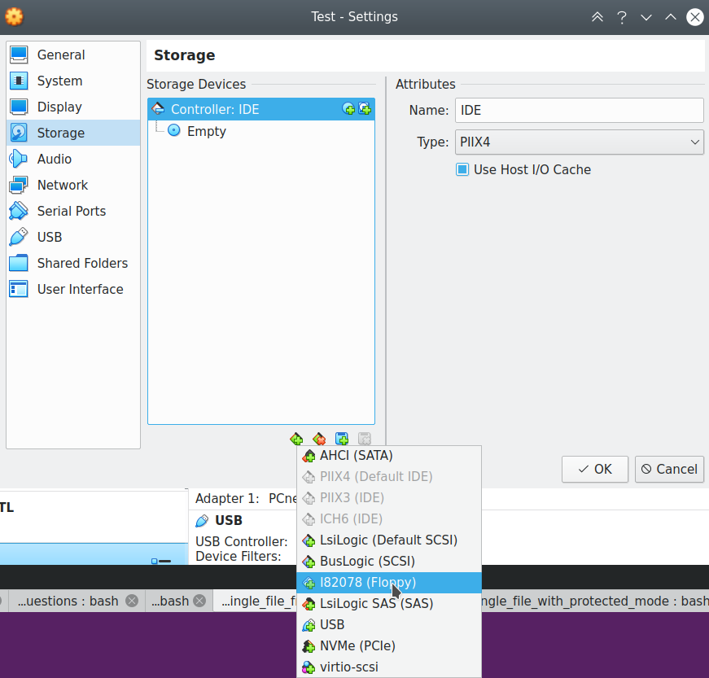
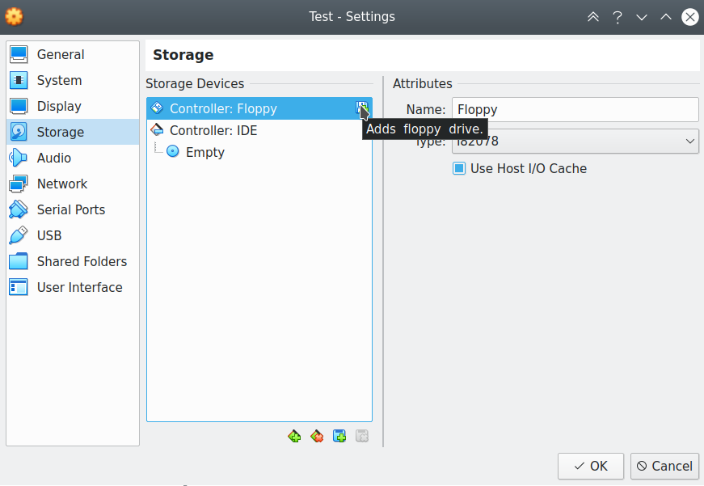
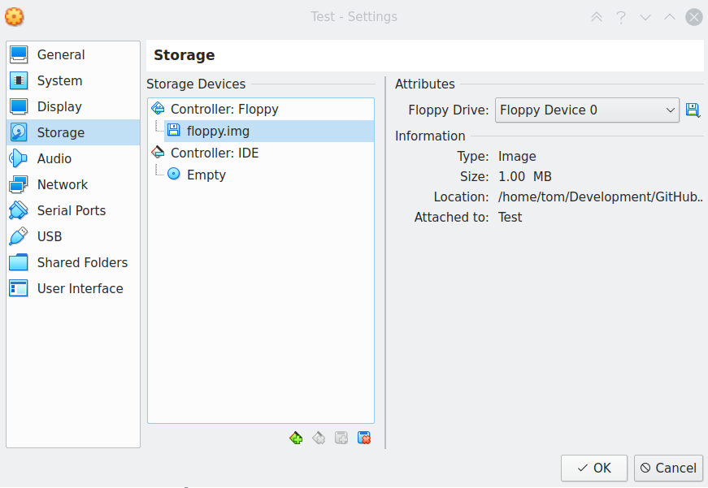

# Booting into 64-bit mode (long mode) on x86

**IN DEVELOPMENT**

From [StackOverflow](https://stackoverflow.com/questions/22962251/how-to-enter-64-bit-mode-on-a-x86-64) I found these instructions to switching to 64-bit mode.

```
If paging is enabled, disable paging.
If CR4.PAE is not already set, set it.
Set IA32_EFER.LME = 1.
Load CR3 with a valid PML4 table.
Enable paging.
At this point you will be in compatibility mode. A far jump may be executed to switch to long mode. However, the offset must not exceed 32-bit
```

## Run in VirtualBox

* Create a new machine with 32MB memory and no hard disk.
* Add a ISO I82078 floppy drive under ```Settings > Storage```

 

* Click on add Floppy Disk Selector and click the Add button

 

* Select your img file

 

* Start the machine.
